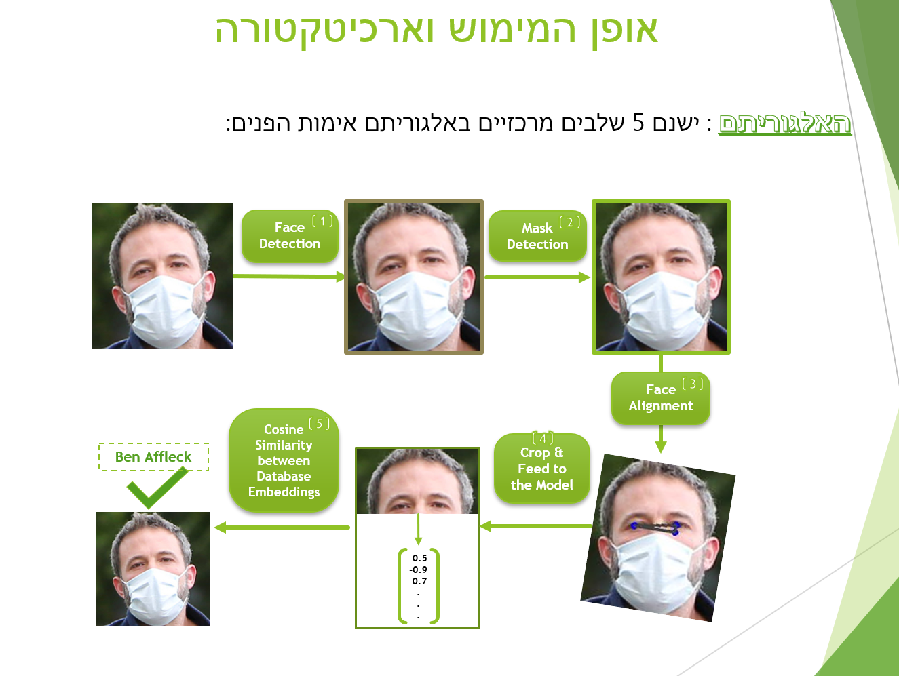

# MFR-Seminar-Project
### Masked Face Recognition - My seminar project as part of my B.sc. Computer Science Studies at the Academic College of Tel-Aviv Yafo.
### The Project Video Showcase : https://youtu.be/rSVMaz55bjA 
### Visual explanation of the overall algorithm's flow :

##### > Main application is in the folder "main_app"

