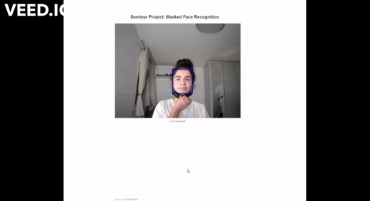
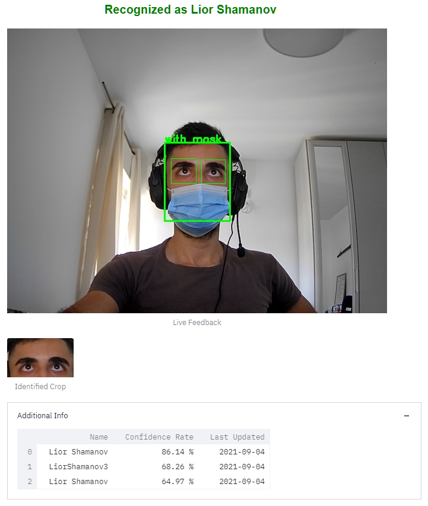

# MFR-Seminar-Project
### Masked Face Recognition - Seminar project as part of my B.sc. Computer Science Studies at the Academic College of Tel-Aviv Yafo, inspired by the recent epidemic.

#### <ins>The Goal</ins> : Identify faces covered by a mask in real-time, using deep learning and classical computer vision.
#### <ins>The Approach</ins> : (picture below for visual explanation)
1. Face detection using MTCNN, and Eyes detection using HaarCascade.
2. Upon satisfying the conditions (steady frame, correct detection) Continue for mask detection.
    * I created the mask detection model using **transfer learning with MobileNetV2** architecture, trained on 100k images of masked faces. for further information refer to "experimental steps" folder, featuring first approach and second approach i took with the model creation.
3. Upon successful mask detection, we procceed to face alignment (to get better face-embbeddings predictions, the faces should be aligned)
4. Face landmarks detection using dlib, to detect a nose landmark on masked face.
5. Using the detected nose landmark, we finely crop the exposed area of the face - from the eyes to the forehead.
6. We use the previous cropped area, and feed it to the ArcFace model, which takes as an input a face, and outputs a feature vector of the respective face embeddings.
    * As stated, ArcFace expects a fully faced picture as its input, so feeding it only the upper part of the face, and expecting an embedding output that could be useful and accurate enough to work with, was a gamble in this project, and upon experimenting, it turned out to be a successful one.
7. Using the face embedding output from the previous step, we will then traverse the entire database of previously saved face embeddings, which are linked by the identity's names, and find the most similar embedding, using the minimal vector distance between embeddings.

### The Project Video Showcase : https://youtu.be/rSVMaz55bjA 
### Visual explanation of the overall algorithm's flow :

##### > Main application is in the folder "main_app"

